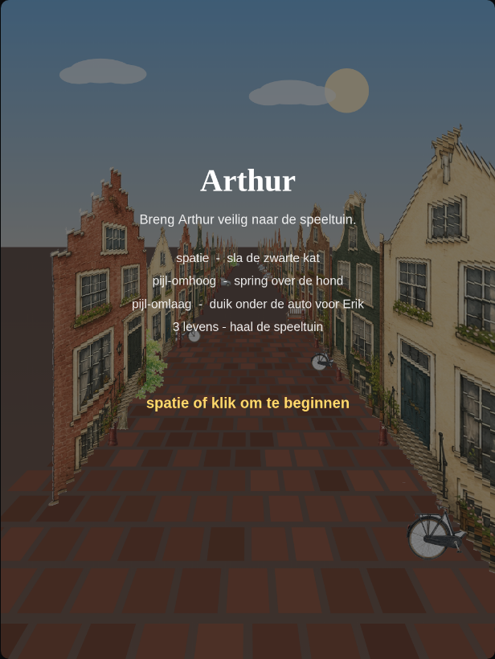
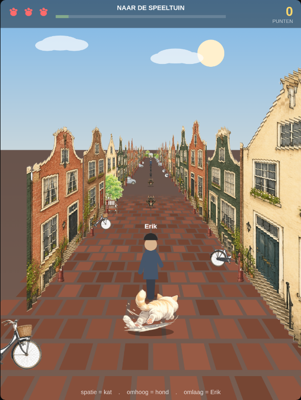
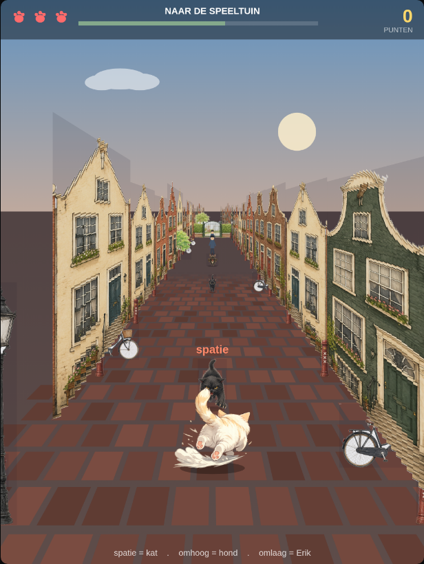
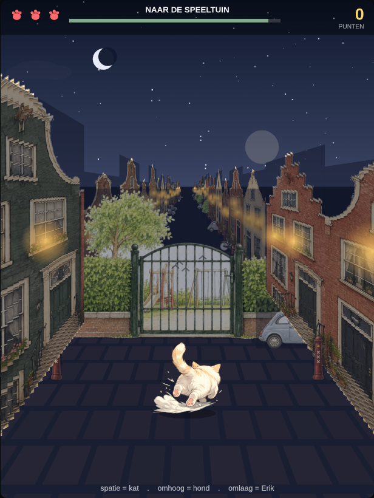
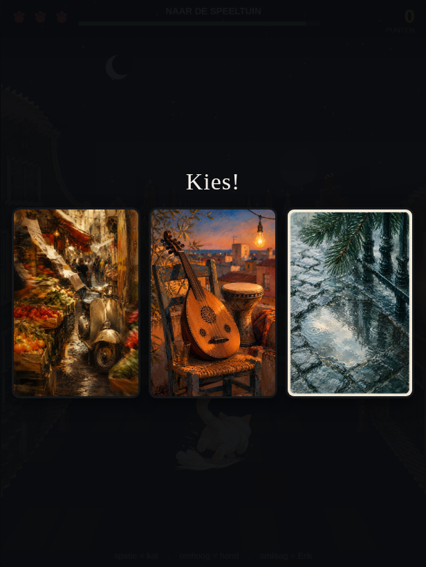
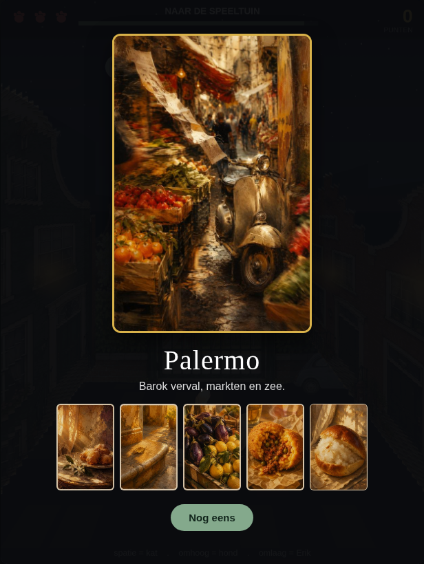

# De Reis — Arthur 🐱

> ## ⚠️ Harde randvoorwaarde: het eindproduct is één zelfstandig, OFFLINE HTML-bestand
> `dist/de-reis.html` moet je kunnen **dubbelklikken zonder internet**. Daarom:
> **geen** externe scripts/CDN, **geen** netwerkverzoeken (`fetch`/XHR), **geen**
> `localStorage`/`sessionStorage`. Alle assets worden bij de build als base64 **ge-inlined**.
> Vanilla JS + `<canvas>`, geen framework, geen runtime-dependencies. Alle in-game tekst
> is bewust **Nederlands** — niet vertalen.

## Wat is het?

Een reactie-runner als verjaardagscadeau: kat **Arthur** rent in perspectief door een
Amsterdamse grachtenstraat, ontwijkt obstakels (sla de kat met **spatie**, spring over de
hond met **↑**, duik onder de auto voor Erik met **↓**), en onthult aan het eind via drie
stadskaarten de geheime reisbestemming: **Marseille**, **Palermo** of **Bilbao**.

Het origineel was één 7 MB HTML-bestand met alle beelden als ingebakken base64 en HTML/CSS/JS
door elkaar. Dit project splitst dat op in een onderhoudbare structuur **zonder** de
offline-single-file-eis te verliezen: een build-script voegt alles weer samen tot één bestand.

|  |  |  |
|---|---|---|
|  |  |  |
|  |  |  |

## Projectstructuur

```
de-reis/
├─ reference/de-reis-game1-v10.html   # origineel, intact (referentie — niet bewerken)
├─ assets/                            # losse, gedecodeerde beelden
│  ├─ cities/   arthur/   houses/   street/   obstacles/
│  └─ manifest.json                   # koppelt elk bestand → exacte originele key, {w,h}
├─ src/
│  ├─ index.html                      # markup + CSS, met <!-- BUILD:INJECT --> marker
│  └─ game.js                         # game-logica (data-blobs eruit; verder verbatim)
├─ build.mjs                          # bouwt het zelfstandige eindbestand
├─ dist/de-reis.html                  # ← het speelbare, offline eindbestand (gegenereerd)
├─ docs/screenshots/                  # verificatie-screenshots
└─ ARCHITECTURE.md                    # diepgaande uitleg van de code
```

> Waarom een `manifest.json`? De stadsfoto's hebben keys als `Marseille_2.png` maar bevatten
> **JPEG**-bytes. De build moet die exacte key én de juiste mime reproduceren. Het manifest
> bewaart de koppeling; op schijf staan ze als `.jpg`. Zie ARCHITECTURE.md §2.

## Builden

Geen dependencies nodig — alleen Node (≥ 18):

```bash
node build.mjs
```

Dit leest `src/` + `assets/`, inlinet alle beelden als base64, en schrijft
`dist/de-reis.html`. Het is **idempotent**: dezelfde input geeft byte-voor-byte dezelfde
output. Open daarna `dist/de-reis.html` door te dubbelklikken — werkt volledig offline.

### Doorontwikkelen

- **Gameplay/visueel tweaken** → bewerk `src/game.js`, run `node build.mjs`, herlaad het
  bestand. Zie de TUNABLES-tabel in ARCHITECTURE.md §10 (loopsnelheid, baanlengte, nacht-curve,
  spawnkansen, klinker- en gevelparameters).
- **Markup/CSS** → bewerk `src/index.html` (laat de `<!-- BUILD:INJECT -->`-marker staan).
- **Beeld vervangen** → vervang het bestand in `assets/…` (zelfde vorm/afmetingen) en
  herbouw. Een nieuw beeld toevoegen? Zet het bestand neer én voeg een entry toe in
  `assets/manifest.json`.

## Testen / verifiëren

De build is geverifieerd met een headless render (Playwright) die:

1. zes spelmomenten screenshot (intro, straat met obstakel, nacht, het hek, het Kies!-scherm,
   en een reveal) — zie `docs/screenshots/`;
2. bevestigt dat er **0 netwerkverzoeken** (http/https/ws) worden gedaan;
3. bevestigt dat er geen pagina-fouten optreden.

Daarnaast is bewezen dat de gebouwde assets **byte-identiek** zijn aan het origineel
(deep-equal van alle vijf data-blobs: `IMAGES`, `ARTHUR_FRAMES`, `HOUSES`, `STREET`, `OBSTI`)
en dat `src/game.js` de originele logica verbatim bevat. Dus: geen gameplay- of visuele
regressie t.o.v. `reference/de-reis-game1-v10.html`.

Snelle eigen sanity-check zonder browser:

```bash
# bouwt en controleert idempotentie
node build.mjs && sha256sum dist/de-reis.html && node build.mjs && sha256sum dist/de-reis.html
```
